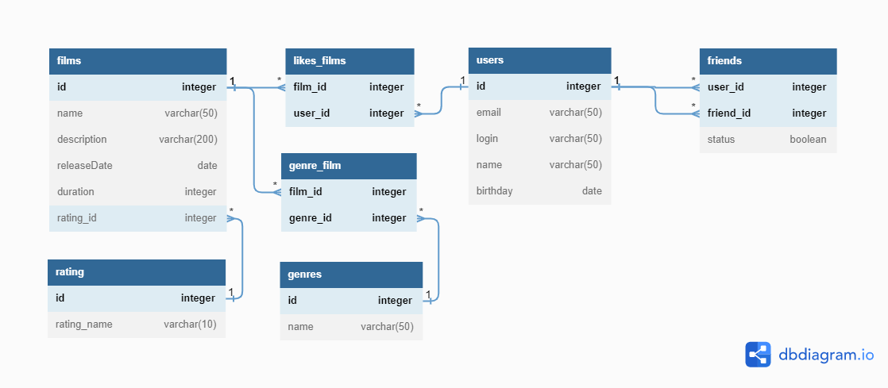

# java-filmorate

# Модель базы данных

## Ссылка на файл диаграммы
https://dbdiagram.io/d/643555438615191cfa8d0026

### Описание
#### films
Таблица хранит данные о фильмах. Имеет связь с таблицей 'rating', 
которая отвечает за рейтинг фильма. Имеет двустороннею связь с таблицей 'genre' через таблицу 'film-genre'.
Также имеет двустороннею связь с таблицей 'user' через таблицу 'likes-films'.

#### users
Таблица хранит данные о пользователях. Имеет связь с таблицами 'friend' и 'likes-films'.

#### likes-films
Таблица хранит данные о лайках пользователей, позволяя видеть, кто и какому фильму поставил лайк.

#### friend
Таблица хранит данные о друзьях пользователя. Поле 'status' отвечает за статус заявки в друзья.